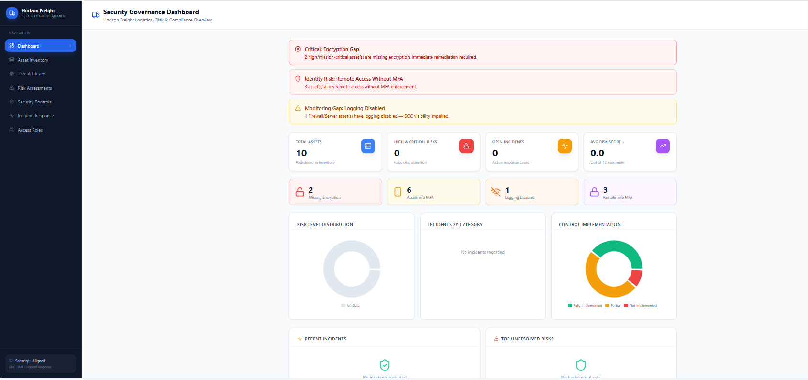
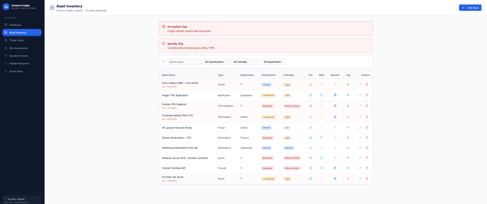
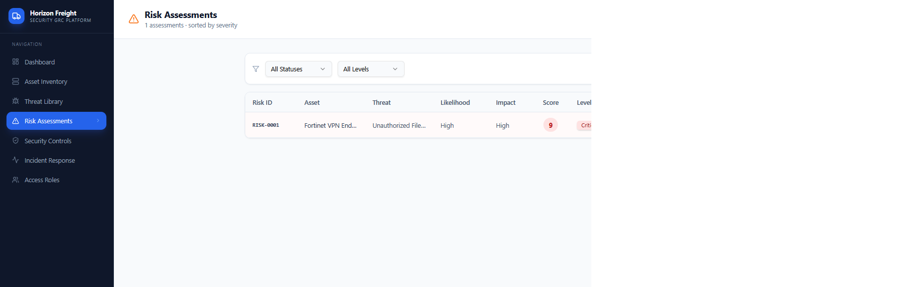
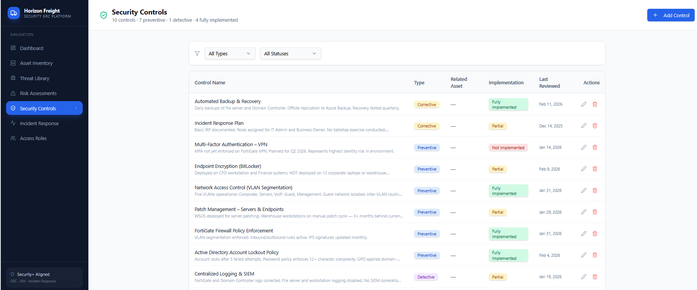
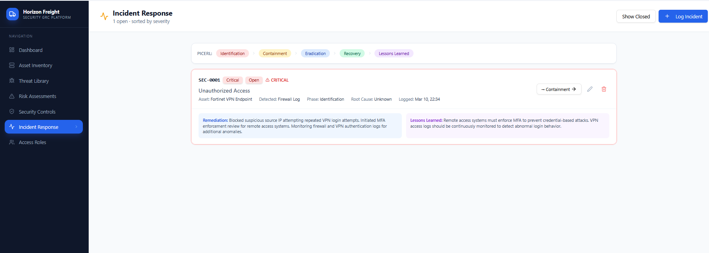

# horizon-freight-security-governance
Security Governance and Risk Management (GRC) simulation including asset inventory, risk assessment, security controls, and compliance monitoring.
# Horizon Freight – Security Governance & Risk Management Platform

This project simulates a **Security Governance, Risk, and Compliance (GRC) environment** for a fictional logistics company, Horizon Freight Logistics.

The platform demonstrates how organizations track assets, identify security risks, enforce security controls, and manage incident response activities across enterprise infrastructure.

The goal of this project is to simulate **real-world security governance workflows** used by security teams to monitor compliance and mitigate operational risk.
## Environment Overview

The Horizon Freight security governance platform manages security posture across multiple enterprise assets.

Environment includes:

• Corporate network infrastructure  
• Remote access VPN systems  
• Domain controllers and servers  
• Corporate workstation fleet  
• Business-critical logistics applications  

Security governance processes implemented in this simulation include:

• Asset inventory management  
• Risk assessment scoring  
• Security control tracking  
• Incident response coordination  
• Compliance monitoring
## Risk Management Model

Risks are evaluated using a simplified enterprise risk scoring model.

Each risk is assessed based on:

• **Asset Criticality** – Importance of the affected system  
• **Threat Likelihood** – Probability of exploitation  
• **Impact Severity** – Potential business impact  

The calculated score determines the overall **risk level** and prioritization for remediation.
## Key Security Findings

The governance dashboard identifies several security gaps within the environment:

### Encryption Gap
Two high-criticality assets were discovered operating without encryption enabled.

### Remote Access Without MFA
Multiple assets were allowing remote access without multi-factor authentication.

### Logging Disabled
Security logging was disabled on key systems, reducing security monitoring visibility.

## Security Governance Dashboard

Overview of the Horizon Freight security governance environment including active risks, compliance gaps, and asset posture.

## Asset Inventory

Asset inventory tracks all infrastructure components including servers, network devices, and endpoints along with encryption, MFA, and logging status.

## Risk Assessments

Security risks are evaluated based on asset criticality, likelihood, and impact. Each risk is assigned a score and mitigation strategy.

## Security Controls

Security controls dashboard tracks implementation status of enterprise security policies and safeguards.

## Incident Response

Incident response workflow used to track, investigate, and remediate security incidents affecting enterprise assets.
## Skills Demonstrated

This project demonstrates applied cybersecurity and governance concepts including:

• Security Governance & Compliance  
• Risk Assessment Methodology  
• Asset Inventory Management  
• Incident Response Coordination  
• Security Control Monitoring  
• Enterprise Security Architecture
